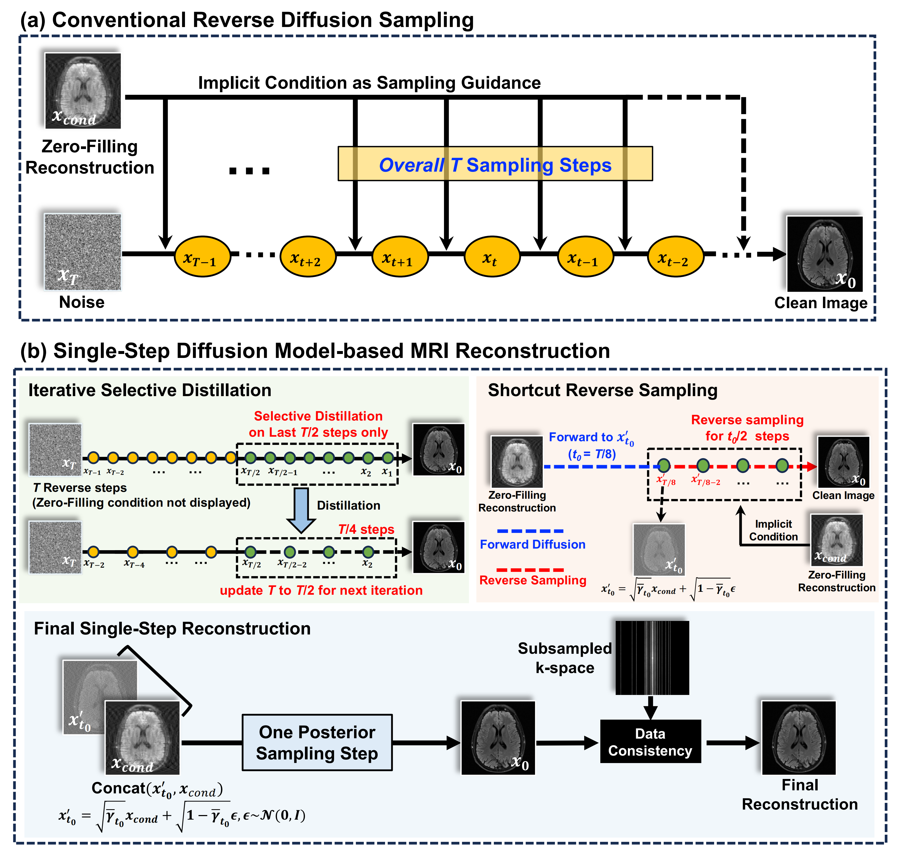
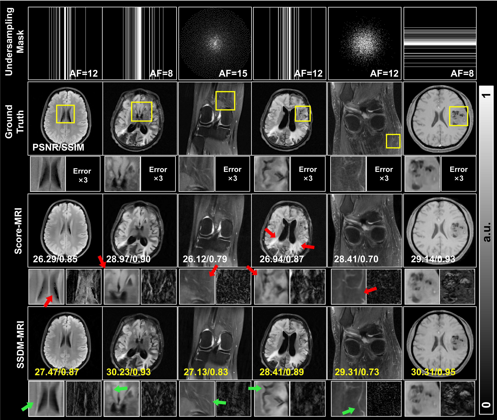

# Highly Undersampled MRI Reconstruction via a Single Posterior Sampling of Diffusion Models
- This repository contains the implementation of our SSDM-MRI method.
- Both Complex_Data and Real_Data folders follow a similar reconstruction pipeline, with slight code differences tailored to the data type: Complex_Data supports both magnitude and phase reconstruction, while Real_Data is for magnitude-only reconstruction.

## Overview
### (1)Overall Framework

Fig.1 Overall framework of the proposed Single-Step Diffusion Model-based MRI reconstruction (SSDM-MRI) method, which is developed by iteratively distilling a pre-trained conditional diffusion model (DM) to reduce the necessary number of reverse sampling steps from original T steps to just one step. (a) demonstrates the original T reverse steps using the pretrained DM, and (b) illustrates the proposed iterative selective distillation, which is only conducted on the second half T/2 steps (green circles) during each iteration, and the paired shortcut reverse sampling strategy, which starts from a single forward diffusion from the zero-filling reconstruction, instead of starting from the pure noise. The bottom panel demonstrates the final single-step reconstruction pipeline after a sufficient number (4 in this work) of iterations of distillation.
### (2)Representative Result

Fig.2 Comparison of the proposed SSDM-MRI with Score-MRI on four brain and two knee images subsampled with different types of masks at acceleration factors. Red arrows point to the reconstruction errors in Score-MRI results, and green arrows point to better fine details preserved in Score-MRI.

# Manual
## Requirements
```python
bash requirements.sh
```


## Pre-Training and Distillation
If you want to train your own model from scratch, take fastMRI as an example:

(1)Enter the fastMRI directory, modify the train path and other training parameters in the config/img_restoration.json file:

```yaml
    "datasets": { // train or test
        "train": {
            "which_dataset": {  // import designated dataset using arguments
                "name": ["data.dataset", "MRI_Restoration"], // import Dataset() class / function(not recommend) from dataset.dataset.py (default is [dataset.dataset.py])
                "args":{ // arguments to initialize dataset
                    "data_root": "train",
                    "acc_factor": -1,
                    "mask_type": "gaussian1d"
                }
            },
```

(2)Then run the following command:  
```python
python run.py -p train -c config/img_restoration.json
```

(3)After completing the pre-training of the model, you can run distillate.py for distillation

## Sampling 
If you want to test with a pre-trained model, still using fastMRI as an example(when calculating PSNR and SSIM, we used threshold processing):

(1) Download the corresponding pre-trained model here [Google Drive](https://drive.google.com/drive/folders/1U7h4jc0bPTq_Imdmb2twTBu7CReW0E3z?usp=drive_link). Create the "checkpoints" folder and put the pre-trained model in it.

(2) Modify the following entries in the config/img_restoration.json file:
```yaml
        "test": {
            "which_dataset": {
                "name": ["data.dataset","MRI_Restoration"], // import Dataset() class / function(not recommend) from default file
                "args":{
                    "data_root": "demo",
                    "acc_factor":8,
                    "mask_type": "gaussian1d"
                }
            },
```

(3) Then run the following command:  
```python
python run.py -p test -c config/img_restoration.json
```

